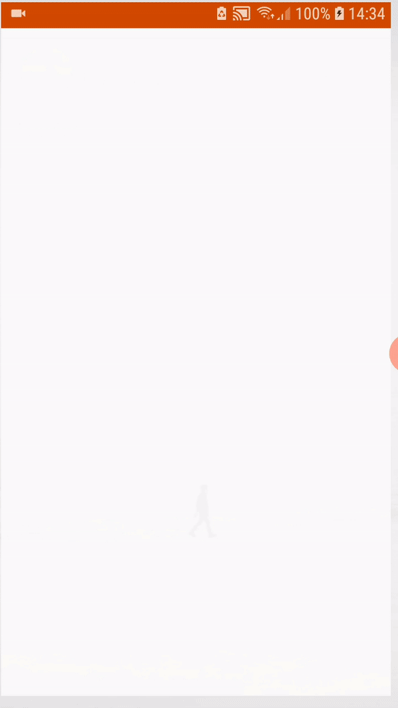
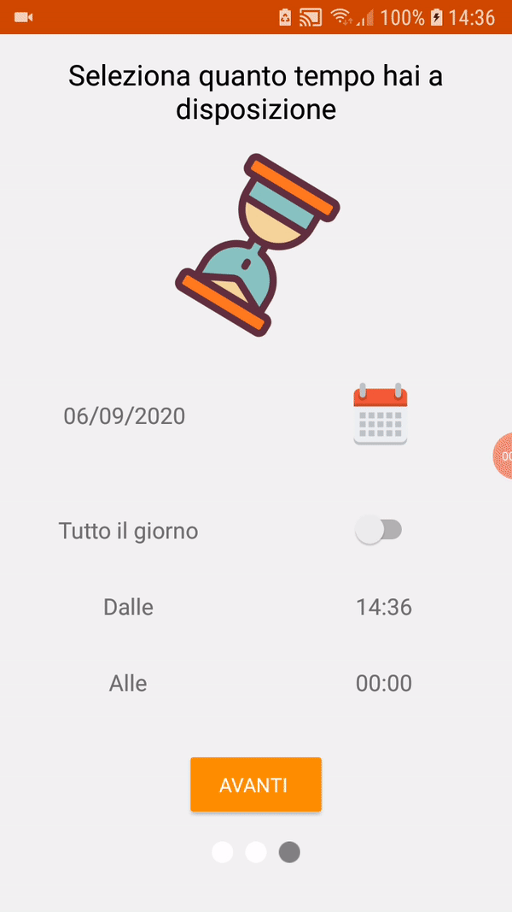

# TOurist :airplane:

TOurist is an Android project created with the aim of lending a hand to tourists who come to visit the city of Turin.

We wanted to give our users a quick report of places of interest, quickly, without registering or paying in the app.

At startup, the app requests 3 information from the user:
 - The number of people you are with
 - The budget you want to spend
 - The time at your disposal
 
After the data is entered, a map will be shown with the relative points of interest and at the top, inside the toolbar, the outside temperature at that time.

Each user's choice in the first 3 screens will modify the final result.

### The number of people you are with
In the first screen, relating to the number of people, the user can select 3 choices: "Single", "In couple" or "In group".

### The budget you want to spend
In the second screen, the one relating to the budget in possession, the user can select two choices: "Free" or enter a range of how much money he wants to spend through a "Range Picker".

The first two screens are closely linked to each other:

Each choice will affect the next screen, for example if you select "Single", then the management of the budget screen will be treated differently, enter 100 euros as the budget available for a "Single", it will give a different result than selecting 100 euros for a "Group".

### The time at your disposal
In the third screen, the one relating to the time available, the user can select the day using a button that acts as a calendar, and finally if he has the whole day available or only a time range, again by selecting.

### Map Result

Finally, the fourth and final screen starts, with toolbar, map and three buttons at the bottom.

Here the user will be asked to activate the GPS, for geolocation, and if the user is outside of Turin, an information popup will be shown, being able to use the app even if not in its main function.

The app name is displayed on the left in the toolbar and the outside temperature at that precise moment on the right.

The points of interest are shown on the map by means of markers based on the choices made so far.

By clicking on the marker that interests us, the main information of the selected seat will be displayed through a custom layout, if some data have not been disclosed, the layout will be modified accordingly.

The map, as well as the toolbar, will change according to the time.

If the app is opened at night, the style of the map and the toolbar will change, two different styles have been used for day and night. :city_sunset:

At the bottom, we have three buttons that are displayed: museums, cinemas and restaurants, used to filter the type of place displayed on the map.

---

### :books: Libraries we used 
Maps SDK - for map management

Places SDK - to access Google's database of information about places around the user

OpenWeather - for managing meteorological data
